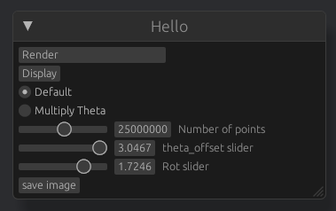

# Rust Fractal Viewer

Written in Rust using Bevy. Currently depends on my unpublished [RustFractal](https://github.com/etscheelk/RustFractal) to be in a local path.

## Method

This is a fractal method I learned about from Paul Cantrell ([innig.net](https://innig.net/)), which randomly transforms a point from rectangular -> polar coordinates, or vice versa. 

It also relies on some tuning parameters, namely theta offset and rotation.

## Run

Do `cargo run`. It'll take a long time to compile, so it goes. 

You will see a settings menu like this:

- Number of points essentially selects the exposure. Don't worry about integer overflow, my fractalize function does checked addition
- Method (Default vs Multiply Theta)
- Theta Offset (angle, radians)
- Rotation (angle, radians)

Rendering takes place asynchronously so the game loop continues. A spinner is displayed while it is rendering, and it is displayed once it is complete. 

The `Save Image` button will simply save a 4096x4096 `png` to crate root titled `my_image.png`. Image naming will be available at a later time. I also plan to add image editing functions: things like levels and curves, which are the main artistic processing I did on the B&W sources.

Examples:

